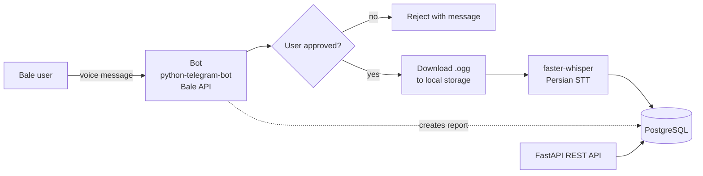
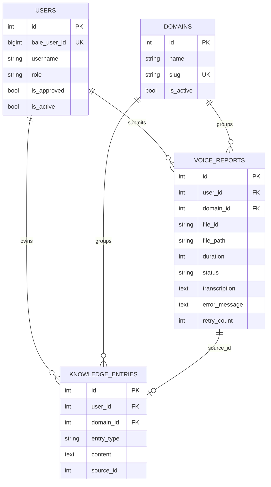

# BaleVoiceReports

> **Turn spoken work reports into a searchable knowledge base.**
> A Bale messenger bot and REST API that receives voice messages from organization members, transcribes them to Persian text, and stores them in a multi-domain PostgreSQL knowledge base.

> سامانه‌ی مرکزی دریافت، ذخیره و بازیابی گزارش‌های سازمانی: کاربر یک پیام صوتی در پیام‌رسان بله می‌فرستد، سیستم آن را به متن فارسی تبدیل می‌کند و در پایگاه دانش ذخیره می‌کند.


---

## Table of contents

- [Overview](#overview)
- [Architecture](#architecture)
- [Features](#features)
- [Tech stack](#tech-stack)
- [Skills demonstrated](#skills-demonstrated)
- [Data model](#data-model)
- [Project structure](#project-structure)
- [Getting started](#getting-started)
- [API reference](#api-reference)
- [Future work](#future-work)

---

## Overview

In many organizations, daily reports are given verbally and then lost. BaleVoiceReports lets a member simply record a voice message in Bale. The system registers the sender, checks that an admin has approved them, downloads the audio, converts speech to Persian text, and saves the result as a structured entry in a knowledge base grouped by **domain** (e.g. `technical`).

## Architecture



Processing steps for each voice message:

1. Get or create the user and verify admin approval
2. Create a `VoiceReport` in `pending` state under the default domain
3. Download the audio from Bale and store it locally (`downloaded`)
4. Transcribe in a worker thread so the event loop is never blocked
5. In **one database commit**: save the transcript on the report, mark it `completed`, and create the matching `KnowledgeEntry`
6. Reply to the user with the tracking ID, duration, domain and extracted text

## Features

- **Bale bot** with `/start`, `/help`, and voice-message handling
- **User approval workflow**: new users are registered automatically but cannot submit reports until approved
- **Role model**: `super_admin`, `domain_admin`, `operator`
- **Persian speech-to-text** with faster-whisper (`small` model, CPU `int8`, VAD filtering, deterministic decoding to reduce hallucinations)
- **Report lifecycle**: `pending → downloading → downloaded → transcribing → completed / failed`, with `error_message` and `retry_count` fields
- **Multi-domain knowledge base**: reports and entries belong to a domain, with a seeded default domain
- **Atomic completion**: report update and knowledge-entry creation happen in a single transaction
- **Async end to end**: FastAPI, SQLAlchemy 2.0 with asyncpg, async bot handlers
- **Versioned schema** with five Alembic migrations, including a data backfill
- **Health endpoints** including a live database connectivity check
- **Docker** setup for PostgreSQL (with healthcheck) and the API image

## Tech stack

| Area | Technology |
|------|-----------|
| Language | Python 3.12 |
| API | FastAPI, Uvicorn, Pydantic v2, pydantic-settings |
| Database | PostgreSQL 16, SQLAlchemy 2.0 (async), asyncpg, Alembic |
| Bot | python-telegram-bot 20 (pointed at the Bale API) |
| Speech-to-text | faster-whisper (Whisper `small`) |
| HTTP client | httpx |
| DevOps | Docker, Docker Compose |

## Skills demonstrated

**Backend engineering**
- Asynchronous Python with `async`/`await`, `asyncio.to_thread` for CPU-bound work, and async SQLAlchemy sessions
- RESTful API design with FastAPI: routers, versioned prefix (`/api/v1`), dependency injection, response models and status codes
- Layered architecture: `api` → `crud` → `models`, with separate `schemas` and `services` layers

**Database design**
- Relational modelling with foreign keys, indexes, unique constraints and cascade rules
- Schema evolution with Alembic: table creation, role/approval columns, status and error fields, domain tables with seed data, and a backfill migration for existing rows
- Transactional consistency (single-commit completion of report and knowledge entry)

**Integrations and AI**
- Building a messenger bot on a Telegram-compatible third-party API (Bale) by overriding the base URL
- Integrating a speech-recognition model (Whisper) into a production-style pipeline, with parameter tuning for Persian accuracy
- Downloading and persisting binary media from an external API

**Configuration, security and DevOps**
- Environment-based configuration with Pydantic Settings and a `.env.example` template
- Role-based access model and an admin-approval gate for users
- Containerization with Docker and Docker Compose, including a PostgreSQL healthcheck
- Secrets hygiene: removing a leaked credential, sanitizing the repository history while preserving the commit log, and ignoring runtime data in version control

**Engineering practice**
- Conventional commit messages and incremental, feature-by-feature history
- Persian-language UX for end users and documentation in English and Persian

## Data model



## Project structure

```
.
├── backend/
│   ├── app/
│   │   ├── api/v1/endpoints/   REST endpoints (users, voice-reports)
│   │   ├── bot/                Bale bot entrypoint and handlers
│   │   ├── core/config.py      Settings loaded from .env
│   │   ├── crud/               Database access layer
│   │   ├── db/                 Async engine and session factory
│   │   ├── models/             User, Domain, VoiceReport, KnowledgeEntry
│   │   ├── schemas/            Pydantic request/response schemas
│   │   ├── services/           Voice download and speech-to-text
│   │   └── main.py             FastAPI application
│   ├── alembic/versions/       Database migrations
│   ├── Dockerfile              API image
│   └── requirements.txt
├── alembic.ini
├── compose.yaml                PostgreSQL service
├── .env.example
└── requirements.txt
```

## Getting started

### Prerequisites

- Python 3.12+
- Docker and Docker Compose
- A Bale bot token (create a bot with Bale's BotFather)

### 1. Configure

```bash
cp .env.example .env
```

Set the database password and your bot token in `.env`:

```env
POSTGRES_PASSWORD=<choose a password>
BALE_BOT_TOKEN=<your bot token>
```

> Never commit `.env`. It is already listed in `.gitignore`.

### 2. Start PostgreSQL

```bash
docker compose up -d postgres
```

### 3. Install dependencies

```bash
python -m venv venv
venv\Scripts\activate          # Windows
# source venv/bin/activate     # Linux / macOS
pip install -r requirements.txt
```

### 4. Apply migrations

```bash
alembic upgrade head
```

### 5. Run the API and the bot

In two terminals:

```bash
uvicorn backend.app.main:app --reload
```

```bash
python -m backend.app.bot.main
```

Interactive API docs are served at http://localhost:8000/docs. The first transcription downloads the Whisper model, so it takes longer than later ones.

### Approving users

New users start with `is_approved = false`. Approve a user directly in the database:

```sql
UPDATE users SET is_approved = true, role = 'super_admin' WHERE bale_user_id = <id>;
```

## API reference

| Method | Path | Description |
|--------|------|-------------|
| GET | `/` | Service info |
| GET | `/api/v1/health` | Health check |
| GET | `/api/v1/db-check` | Live database connectivity check |
| POST | `/api/v1/users/` | Create or fetch a user by Bale ID |
| GET | `/api/v1/users/{bale_user_id}` | Get a user |
| POST | `/api/v1/voice-reports/` | Create a voice report record |
| GET | `/api/v1/voice-reports/user/{user_id}` | List a user's reports |

## Future work

Ideas for scaling and extending the project:

**Security and access**
- JWT or API-key authentication with role-based permissions on every endpoint
- In-bot admin commands to approve, deactivate and change roles of users
- Rate limiting and audit logging

**Reliability**
- Background job queue (Celery, ARQ or RQ) with automatic retries, backoff and use of the `failed` status
- Structured logging, metrics and tracing (Prometheus, OpenTelemetry), with credentials masked in logs
- Object storage (S3 or MinIO) instead of the local disk for audio files

**Knowledge base and AI**
- Full-text search in PostgreSQL, then semantic search with pgvector embeddings
- LLM-generated summaries, action-item extraction and daily or weekly digests per domain
- Larger Whisper models or GPU inference for higher Persian accuracy, plus transcript correction

**Product**
- Domain selection from inside the bot, and text-based entries alongside voice
- Web dashboard for browsing, filtering and exporting reports
- Notifications to managers when new reports arrive

**Quality and delivery**
- Unit and integration tests with pytest and httpx, run in GitHub Actions CI
- Linting and type checking (ruff, mypy) with pre-commit hooks
- Full Docker Compose stack (API, bot, database) and a production deployment guide

## License

No license specified.
